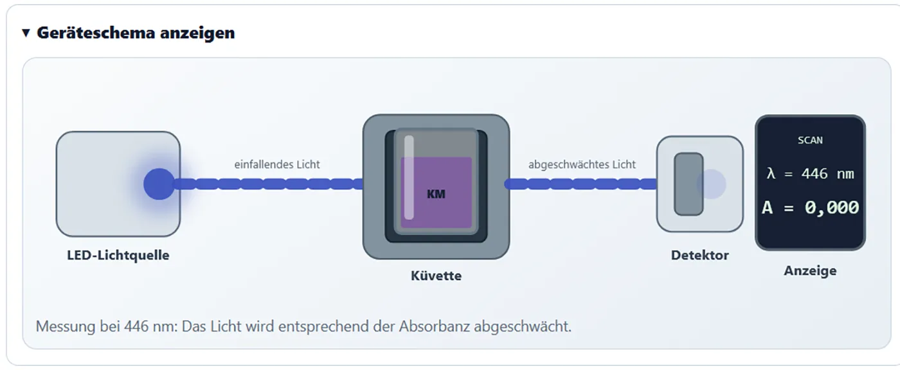
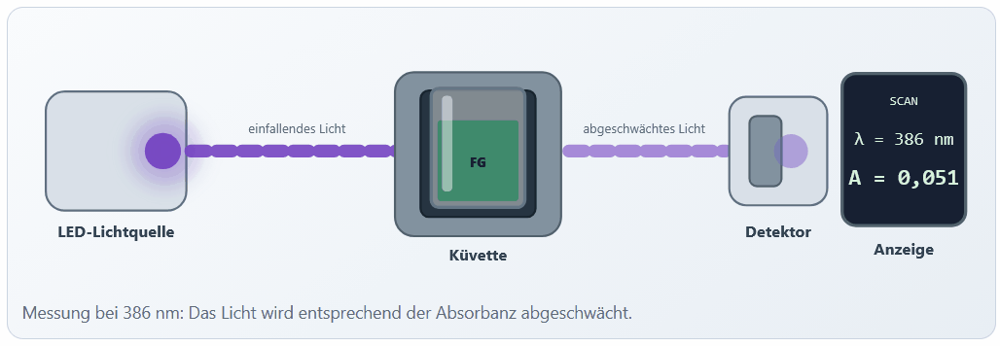

# Das schematische Photometer

## Vom Messwert zum physikalischen Instrument

Ein Photometer kann für AnfängerInnen leicht als Black Box erscheinen: Eine Probe wird eingesetzt und eine Zahl wird angezeigt. Das schematische Gerät in SpektralLab macht den Messweg sichtbar, ohne technische Details zu überladen.

Dargestellt werden:

1. LED-Lichtquelle,
2. linearer Lichtstrahl,
3. Küvette mit farbiger Lösung,
4. abgeschwächter austretender Lichtstrahl,
5. Detektor,
6. digitale Anzeige.
{ loading=lazy }

## Bewusste Vereinfachung

Nicht dargestellt werden:

- Prisma oder Beugungsgitter,
- Monochromator,
- Linsen und Spiegel,
- reale Strahlaufweitung,
- Detektorelektronik,
- geometrische Veränderung der Schichtdicke.

Die App verwendet das Modell einer direkt gewählten LED-Wellenlänge. Die Schichtdicke beeinflusst die Berechnung, wird aber im Schema nicht durch eine breitere oder schmälere Küvette visualisiert.

## Die Messanimation

Im Spektren- und Eichkurvenmodus läuft eine kurze kombinierte Animation ab:

1. Küvette wird in den Schacht eingesetzt.
2. LED wird aktiviert.
3. Lichtstrahl erreicht die Probe.
4. Hinter der Probe erscheint derselbe Spektralfarbton mit geringerer Intensität.
5. Detektor reagiert.
6. Messwert erscheint auf der Anzeige.

## Wellenlänge und Lichtfarbe

Die Strahlfarbe wird näherungsweise aus der aktuellen Wellenlänge erzeugt:

- violett und blau bei kurzen Wellenlängen,
- grün im mittleren sichtbaren Bereich,
- orange und rot bei langen Wellenlängen.

Die Darstellung ist didaktisch angenähert. Monitor, Browser und menschliche Farbwahrnehmung erlauben keine exakte spektrale Wiedergabe.

## Absorbanz und Abschwächung

Die Strahlintensität hinter der Küvette orientiert sich an:

\[
T=10^{-A}
\]

Bei kleiner Absorbanz ist die Abschwächung gering. Bei großer Absorbanz bleibt nur ein schwacher Reststrahl sichtbar. Die grafische Untergrenze verhindert, dass der Strahl vollständig verschwindet.

## Konzentration und Farbtiefe

Im Eichkurvenmodus ändert sich zusätzlich die Farbtiefe der Flüssigkeit:

- Blindprobe: nahezu farblos,
- niedriger Standard: heller Farbton,
- hoher Standard: kräftiger Farbton,
- unbekannte Probe: Farbtiefe entsprechend ihrer modellierten Konzentration.

Diese Darstellung ist qualitativ und nicht farbmetrisch kalibriert. Sie zeigt jedoch, dass deutliche Konzentrationsunterschiede häufig bereits am Farbeindruck erkennbar sind.

<!-- ANIMATION GE-03 | DATEI: ../assets/images/analytik/photometer/ge03_standardreihe_farbintensitaet.gif | MOTIV: nacheinander Blindprobe, niedrigster Standard, mittlerer Standard und höchster Standard messen; Fokus auf Küvettenfarbtiefe und Strahlabschwächung | ALT: Konzentrationsabhängige Farbtiefe einer Standardreihe im schematischen Photometer | DAUER: 8–12 s | LOOP: ja | PRIORITÄT: B | EINFÜGEN ALS:  -->

## Einsatz im Unterricht

Das Geräteschema ist besonders geeignet für:

- Einführung in die Photometrie,
- Erklärung des Nullabgleichs,
- Zusammenhang von Wellenlänge und Lichtfarbe,
- qualitative Deutung der Absorbanz,
- Vorbereitung eines realen Gerätepraktikums.

Bei Routinemessungen kann der Bereich eingeklappt werden. In den fortgeschrittenen dynamischen Modulen bleibt er vollständig ausgeblendet.
