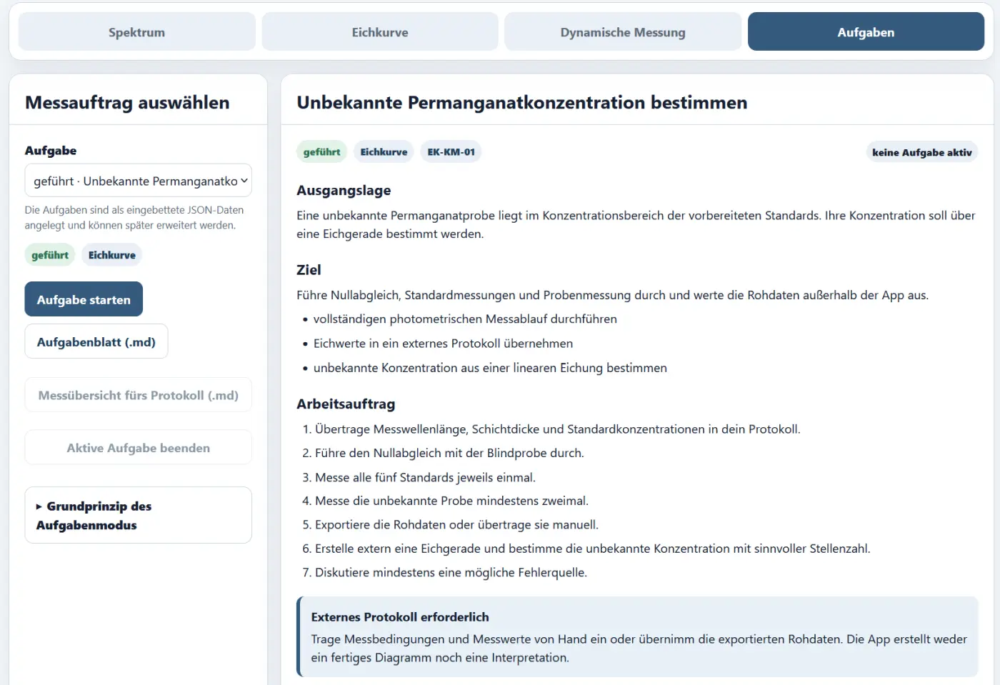

# Aufgabenmodus und externes Protokoll

## Ziel des Aufgabenmodus

Der Aufgabenmodus verknüpft die Messfunktionen mit konkreten schulischen Arbeitsaufträgen. Er liefert keine automatische Komplettlösung, sondern strukturiert den Übergang vom virtuellen Messgerät zum naturwissenschaftlichen Protokoll.

## Anspruchsniveaus

### Geführt

- Messbedingungen weitgehend vorgegeben,
- klare Schrittfolge,
- geeignet für den ersten vollständigen Ablauf.

### Teiloffen

- einige Bedingungen müssen geprüft oder angepasst werden,
- Auswertungsentscheidungen werden begründet.

### Offen

- Problemstellung und Ziel sind vorgegeben,
- Messplan und Auswertung werden selbst entwickelt.

<!-- ABBILDUNG AU-01 | DATEI: ../assets/images/analytik/photometer/au01_aufgabenauswahl.webp | MOTIV: Aufgabenmodus mit Auswahlliste, Niveau-Badges, Titel, Ausgangslage und Ziel | ALT: Auswahl einer geführten, teiloffenen oder offenen Aufgabe | PRIORITÄT: A | EINFÜGEN ALS: { loading=lazy } -->

## Enthaltene Aufgaben

### Spektren

- `SP-KM-01` – Vom Lösungsfarbton zum Absorptionsmaximum
- `SP-VG-02` – Zwei farbige Lösungen, zwei Spektralformen

### Eichkurven

- `EK-KM-01` – Unbekannte Permanganatkonzentration bestimmen
- `EK-BB-02` – Eichreihe für einen Lebensmittelfarbstoff prüfen
- `EK-TA-03` – Eine Eichstrategie selbst planen

### Fehlerdiagnose

- `FE-KM-01` – Eine fehlerhafte Eichreihe untersuchen

### Gleichgewicht

- `EQ-BTB-01` – Drei pH-Werte, drei Spektren
- `EQ-BTB-02` – Den Umschlagsbereich spektral erkunden

### Kinetik

- `KI-CV-01`, `KI-CV-02`
- `KI-BB-01`, `KI-BB-02`
- `KI-UHR-01`, `KI-UHR-02`

## Ablauf einer Aufgabe

1. Aufgabe auswählen.
2. Ausgangslage, Ziel und Lernziele lesen.
3. Aufgabenblatt bei Bedarf als Markdown exportieren.
4. Aufgabe starten.
5. App übernimmt passende Ausgangsbedingungen.
6. Messung durchführen.
7. Rohdaten manuell übertragen oder als CSV exportieren.
8. Auswertung außerhalb der App erstellen.
9. Protokoll-Checkliste aktualisieren.
10. Messübersicht als Markdown exportieren.

<!-- ABBILDUNG AU-02 | DATEI: ../assets/images/analytik/photometer/au02_workflow.svg | MOTIV: selbst erstelltes Ablaufdiagramm Aufgabe wählen → messen → exportieren → extern auswerten → protokollieren | ALT: Arbeitsablauf vom Messauftrag zum externen Protokoll | PRIORITÄT: B | EINFÜGEN ALS:  -->

## Protokoll-Checkliste

Die Checkliste speichert nur den Arbeitsfortschritt. Sie enthält keine ausformulierten Antworten.

Typische Punkte:

- Fragestellung,
- Hypothese,
- Messbedingungen,
- Rohdaten,
- Diagramm,
- Berechnung,
- Interpretation,
- Fehlerdiskussion,
- Schlussfolgerung.

<!-- ABBILDUNG AU-03 | DATEI: ../assets/images/analytik/photometer/au03_protokoll_checkliste.webp | MOTIV: ausgeklappte Protokoll-Checkliste einer Aufgabe | ALT: Checkliste für ein extern geführtes Versuchsprotokoll | PRIORITÄT: B | EINFÜGEN ALS: { loading=lazy } -->

## Warum ein externes Protokoll?

Eine integrierte Textverarbeitung würde die App erheblich vergrößern und könnte zu einer automatischen Ergebnisproduktion verleiten. Das externe Protokoll zwingt zu Entscheidungen:

- Welche Werte werden übernommen?
- Welcher Diagrammtyp ist passend?
- Welche Achsen und Einheiten sind erforderlich?
- Wie wird die Regression interpretiert?
- Welche Fehlerursachen sind plausibel?

## Aufgabenblatt und Messübersicht

### Aufgabenblatt

Enthält:

- Aufgaben-ID,
- Niveau,
- Ausgangslage,
- Ziel,
- Lernziele,
- Arbeitsauftrag,
- Protokollgliederung.

### Messübersicht

Enthält:

- aktive Aufgabe,
- Versuchskennung,
- Messbedingungen,
- vorhandene Rohdaten.

Nicht enthalten sind fertige Regression, Interpretation oder Musterlösung.

## LehrerInnenmodus

Im Aufgabenbereich werden ergänzende Hinweise zur erwarteten Vorgehensweise eingeblendet. Die eigentliche Kontrollauswertung findet in den jeweiligen Messmodulen statt.

## Eigene Aufgaben ergänzen

Die Aufgaben sind in einer eingebetteten JSON-Struktur gespeichert. Neue Aufgaben können ergänzt werden, ohne die Messlogik zu verändern.

Eine Aufgabe benötigt unter anderem:

```json
{
  "id": "eindeutige_id",
  "shortCode": "AB-KZ-01",
  "title": "Aufgabentitel",
  "level": "guided",
  "mode": "calibration",
  "situation": "...",
  "goal": "...",
  "learningGoals": [],
  "instructions": [],
  "protocol": [],
  "setup": {},
  "teacherNotes": []
}
```

Für die öffentliche Kursdokumentation genügt zunächst die vorhandene Aufgabenbibliothek.
