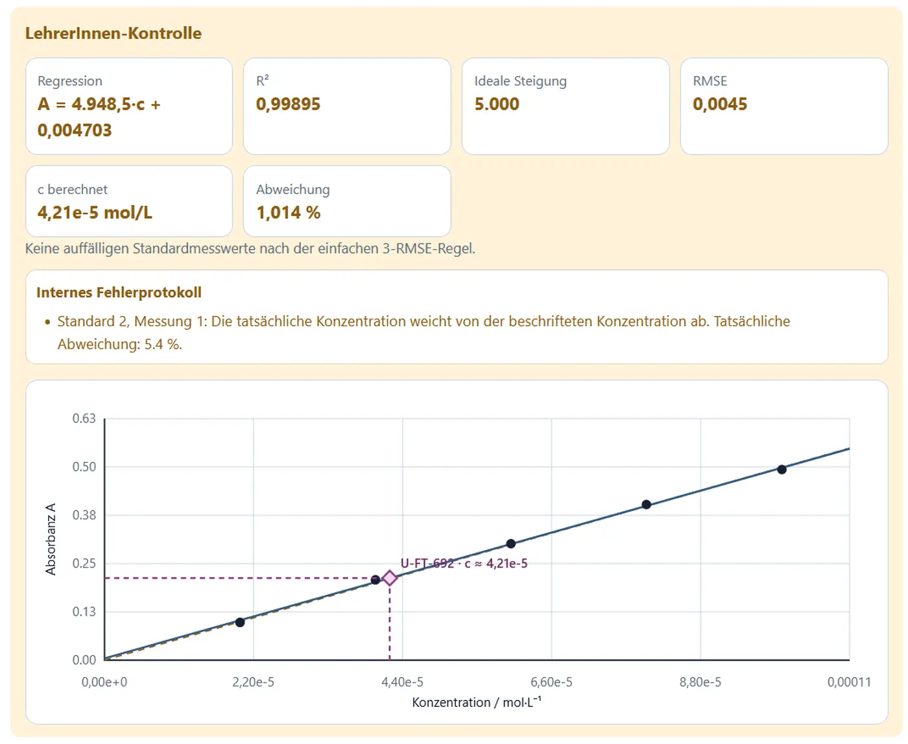

# Eichkurven und unbekannte Proben

## Ziel

Eine Eichkurve verbindet bekannte Konzentrationen mit gemessenen Absorbanzen. Aus dem Signal einer unbekannten Probe kann anschließend ihre Konzentration bestimmt werden.

Die App bildet den gesamten Messablauf ab, liefert im SchülerInnenmodus aber bewusst keine fertige Regression.

## Grundprinzip

Bei fester Wellenlänge und Schichtdicke gilt näherungsweise:

\[
A=m\cdot c+b
\]

Im Idealfall ist \(b\) nach einem korrekten Nullabgleich nahe null. Reale Messwerte streuen um die Ausgleichsgerade.

## Messreihe vorbereiten

1. Stoff auswählen.
2. Messwellenlänge festlegen.
3. Schichtdicke kontrollieren.
4. fünf Standardkonzentrationen prüfen oder bearbeiten.
5. Zahl der Wiederholungen wählen.
6. **Neue Messreihe** starten.

Die App vergibt:

- eine Versuchskennung,
- eine Kennung für die unbekannte Probe,
- eine innerhalb der Sitzung reproduzierbare Messstreuung.

## Nullabgleich

Vor der Messung der Standards muss die Blindprobe gemessen werden.

Ein ungeeigneter Blindwert kann im Lern- oder Diagnosemodus die gesamte Messreihe systematisch verschieben.

## Standards messen

Jeder Standard kann einzeln oder mehrfach gemessen werden. Wiederholungen werden als getrennte Rohwerte gespeichert.

Empfehlung für EinsteigerInnen:

- zunächst Einzelmessungen,
- danach drei Wiederholungen eines ausgewählten Standards,
- Streuung vergleichen,
- Mittelwert extern berechnen.

## Unbekannte Probe

Die unbekannte Probe erhält eine Kennung, beispielsweise `U-KM-...`. Ihre wahre Konzentration bleibt im SchülerInnenmodus verborgen.

Die Konzentration wird extern aus der Regressionsgleichung bestimmt:

\[
c_\mathrm{unbekannt}=\frac{A_\mathrm{unbekannt}-b}{m}
\]

## LehrerInnenansicht

Die LehrerInnenansicht zeigt:

- Regressionsgleichung,
- \(R^2\),
- Kontrollkonzentration,
- relative Abweichung,
- auffällige Messwerte,
- Eichdiagramm.

Die unbekannte Probe erscheint als eigener Diamant mit Hilfslinien. Sie wird nicht in die Regression der Standards einbezogen.

{ loading=lazy }

## Messstreuung

Auch im Normalbetrieb sind die Werte nicht perfekt. Das ist beabsichtigt:

- Wiederholungsmessungen unterscheiden sich leicht,
- \(R^2\) liegt nicht immer exakt bei 1,
- ein Mittelwert ist sinnvoll,
- Datenqualität muss beurteilt werden.

!!! info "Warum nicht perfekte Messwerte?"
    Eine exakt auf der Geraden liegende Messreihe vermittelt ein unrealistisches Bild analytischer Arbeit. Moderate Streuung eröffnet Gespräche über Präzision, Wiederholungen und Unsicherheit.

## Geeignete Stoffe

### Kaliumpermanganat

- übersichtliche Standardreihe,
- deutliche Farbe,
- gut für einen geführten Einstieg.

### Brillantblau und Fast Green

- sehr hohe molare Absorption,
- kleine Konzentrationen,
- Anschluss an Lebensmittelfarbstoffe.

### Kupfer(II)-Systeme

- deutlich höhere Konzentrationen,
- breite und schwächere Absorptionsbanden,
- guter Vergleich unterschiedlicher Empfindlichkeiten.

## Externe Auswertung

Die SchülerInnen sollen mindestens dokumentieren:

1. Stoff und Messwellenlänge,
2. Schichtdicke,
3. Standardkonzentrationen,
4. einzelne Rohwerte,
5. Mittelwerte bei Wiederholungen,
6. Eichdiagramm,
7. Regressionsgleichung,
8. \(R^2\),
9. Konzentration der unbekannten Probe,
10. Fehlerdiskussion.

<!-- ABBILDUNG EK-03 | DATEI: ../assets/images/analytik/photometer/ek03_rohwerttabelle.webp | MOTIV: Eichkurven-Rohwerttabelle mit Wiederholungsmessungen, unbekannter Probe und Laborhinweis-Spalte | ALT: Rohwerttabelle einer photometrischen Eichreihe | PRIORITÄT: B | EINFÜGEN ALS: { loading=lazy } -->

## Interpolation und Extrapolation

Eine unbekannte Probe sollte innerhalb des Bereichs der Standards liegen. Liegt ihr Signal außerhalb, wäre eine Extrapolation erforderlich. In einem realen Labor sollte die Probe dann verdünnt oder die Standardreihe angepasst werden.

## Qualitätsfragen

- Decken die Standards den relevanten Bereich ab?
- Sind sie gleichmäßig verteilt?
- Gibt es zu hohe Absorbanzen?
- Ist die Streuung bei einem Standard ungewöhnlich groß?
- Liegt die unbekannte Probe innerhalb des Eichbereichs?
- Ist ein Ausschluss einzelner Werte fachlich begründbar?

## Rohdatenexport

Die CSV-Datei enthält:

- Aufgabenkennung, sofern aktiv,
- Versuchskennung,
- Stoff,
- Probentyp,
- Konzentration der Standards,
- Wellenlänge,
- Schichtdicke,
- Wiederholungsnummer,
- Absorbanz,
- sichtbare Laborhinweise,
- Zeitstempel,
- Metadatenblock.

Die Datei ist für eine externe Tabellenkalkulation oder das geplante `MESSWERT_LAB` vorgesehen.
