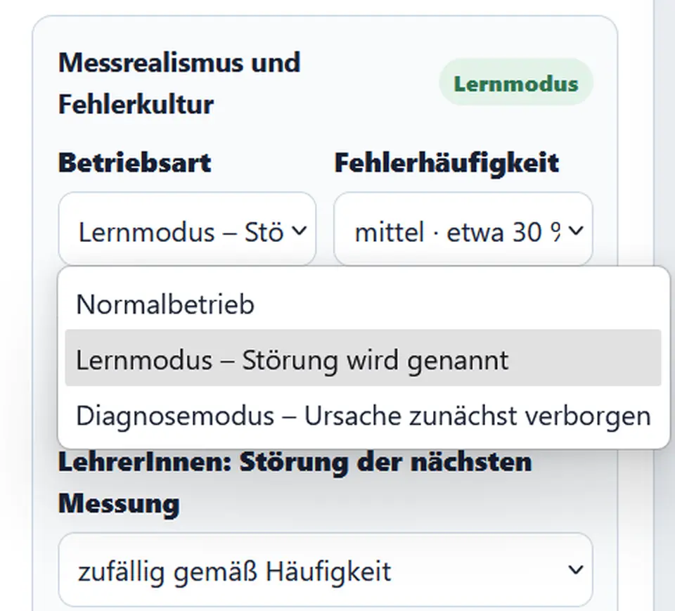
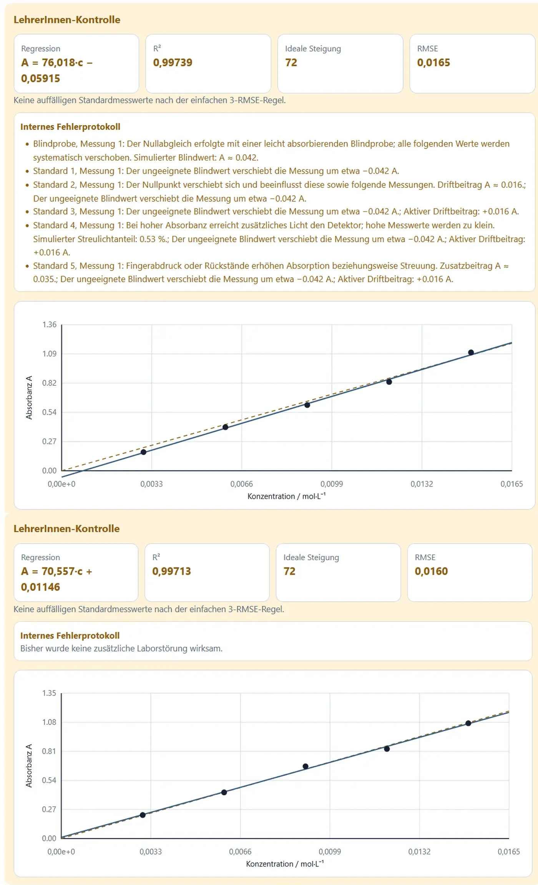

# Messrealismus und Fehlerkultur

## Warum Fehler Teil des Lernens sind

Laborarbeit besteht nicht nur aus dem Anwenden einer Formel. Messwerte müssen geprüft, wiederholt und kritisch eingeordnet werden. SpektralLab unterscheidet deshalb zwischen natürlicher Streuung und zusätzlichen Laborproblemen.

## Drei Betriebsarten

### Normalbetrieb

- moderate natürliche Messstreuung,
- keine zusätzlichen systematischen Störungen,
- geeignet für den Einstieg und Routinemessungen.

### Lernmodus

- Störungen treten zufällig auf,
- Ursache wird nach der Messung genannt,
- geeignet zum Kennenlernen typischer Fehlerbilder.

### Diagnosemodus

- Störung beeinflusst den Messwert,
- Ursache bleibt zunächst verborgen,
- SchülerInnen müssen Datenmuster untersuchen,
- Auflösung ist später möglich.

{ loading=lazy }

## Fehlerhäufigkeit

In Lern- und Diagnosemodus kann die Häufigkeit gewählt werden:

- gering: ungefähr 15 %,
- mittel: ungefähr 30 %,
- hoch: ungefähr 50 %.

Die Prozentwerte sind didaktische Wahrscheinlichkeiten und keine Laborstatistik.

## Simulierte Laborprobleme

| Störung | typische Wirkung |
|---|---|
| ungeeignete Blindprobe | systematische Verschiebung folgender Messungen |
| verschmutzte Küvette | zusätzliche Absorption oder Streuung |
| Luftblase / unvollständige Füllung | zu kleiner effektiver Lichtweg, Messwert zu niedrig |
| Pipettier- oder Verdünnungsfehler | tatsächliche Konzentration weicht vom Etikett ab |
| Wellenlängenabweichung | Messung erfolgt neben der eingestellten Wellenlänge |
| Nullpunktdrift | additive Verschiebung über mehrere Messungen |
| Streulicht | hohe Absorbanzen werden zu klein gemessen |

## Zufällige und systematische Fehler

### Zufällige Fehler

- ändern Richtung und Größe,
- führen zu Streuung,
- können durch Wiederholungen und Mittelwerte reduziert werden.

### Systematische Fehler

- verschieben mehrere Werte in ähnlicher Richtung,
- werden durch Wiederholungen nicht automatisch beseitigt,
- erfordern eine Korrektur des Messaufbaus oder Nullabgleichs.

## Beispiel: ungeeignete Blindprobe

Wird mit einer leicht absorbierenden Blindprobe abgeglichen, werden alle nachfolgenden Signale zu klein. Eine erneute Messung desselben Standards löst das Problem nicht. Erst ein korrekter Nullabgleich beseitigt den systematischen Versatz.

{ loading=lazy }

## Beispiel: Streulicht

Bei hoher realer Absorbanz erreicht fast kein direktes Licht den Detektor. Ein kleiner zusätzlicher Lichtanteil kann dann relativ stark ins Gewicht fallen. Der gemessene Wert fällt zu niedrig aus, und die Eichkurve krümmt sich bei hohen Konzentrationen ab.

## LehrerInnensteuerung

Im LehrerInnenmodus kann die Störung der nächsten Messung gezielt gewählt werden. Die Auswahl gilt einmalig und springt anschließend auf die Zufallseinstellung zurück.

Diese Funktion eignet sich für:

- vorbereitete Diagnoseaufgaben,
- Demonstration eines bestimmten Fehlerbilds,
- Vergleich mehrerer Gruppen mit unterschiedlichen Störungen.

## Diagnoseaufgabe FE-KM-01

Die Aufgabe **Eine fehlerhafte Eichreihe untersuchen** startet eine Permanganatmessung mit absichtlich ungeeigneter Blindprobe.

Möglicher Ablauf:

1. vollständige Eichreihe messen,
2. Diagramm erstellen,
3. systematischen Versatz beschreiben,
4. Fehlerhypothese formulieren,
5. ausgewählte Messungen oder Nullabgleich wiederholen,
6. erst danach die Auflösung nutzen.

<!-- ABBILDUNG FE-03 | DATEI: ../assets/images/analytik/photometer/fe03_diagnoseaufgabe.webp | MOTIV: Aufgabenkarte FE-KM-01 mit Ausgangslage und Arbeitsauftrag | ALT: Diagnoseaufgabe zu einer fehlerhaften photometrischen Eichreihe | PRIORITÄT: B | EINFÜGEN ALS: { loading=lazy } -->

## Leitfragen für die Fehlerdiskussion

- Betrifft die Abweichung einen einzelnen Punkt oder die gesamte Reihe?
- Ändert sich der Fehler bei einer Wiederholung?
- Ist der Fehler additiv oder proportional?
- Wird nur der höchste Messwert auffällig?
- Passt das Fehlerbild zu einer verschmutzten Küvette?
- Könnte die Messwellenlänge falsch sein?
- Muss die Probe, der Standard oder der Nullabgleich wiederholt werden?

## Grenzen der Simulation

- reale Fehler können gleichzeitig auftreten,
- Auswirkungen hängen vom Gerät und Versuchsaufbau ab,
- die App verwendet vereinfachte mathematische Effekte,
- Fehlerursachen sind nicht aus jedem Datensatz eindeutig beweisbar.

Die Diagnose soll daher als begründete Hypothese formuliert werden, nicht als automatisches Etikett.
