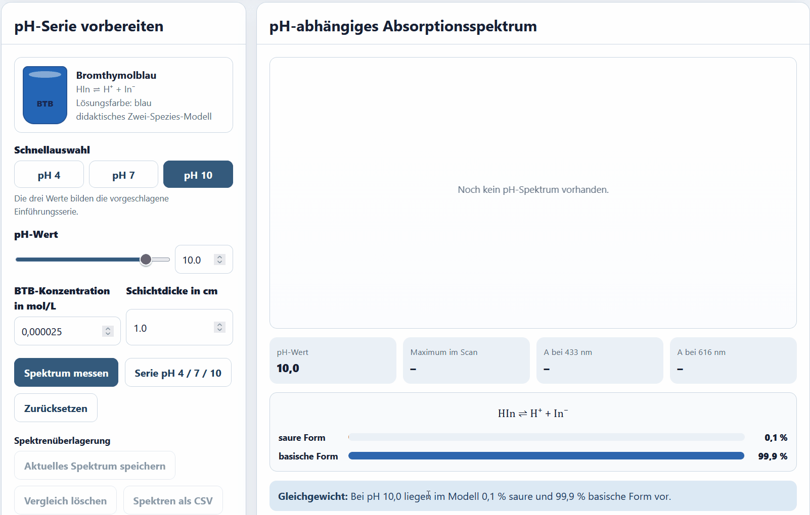
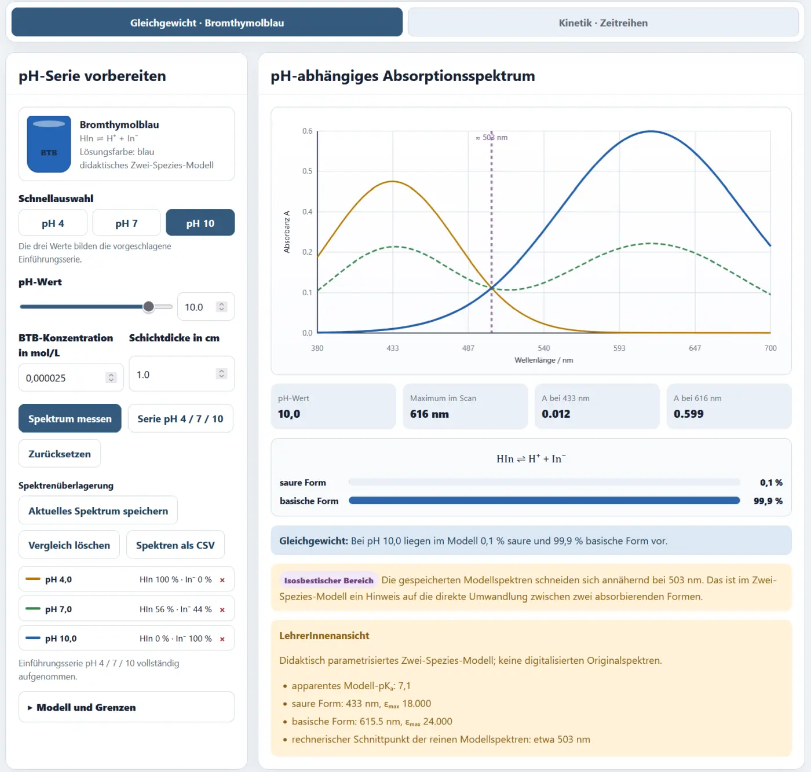

# pH-abhängige Spektren und Säure-Base-Gleichgewicht

## Bromthymolblau als Modellsystem

Bromthymolblau wird im schulisch relevanten Bereich vereinfacht als Gleichgewicht zweier absorbierender Formen behandelt:

\[
\mathrm{HIn \rightleftharpoons H^+ + In^-}
\]

- \(\mathrm{HIn}\): gelbe saure Form,
- \(\mathrm{In^-}\): blaue basische Form.

Im Übergangsbereich liegen beide Formen gleichzeitig vor. Die Lösung erscheint grünlich, weil sich ihre Absorptionsspektren überlagern.

## Modell in der App

Die Anteile werden mit einem apparenten Modellwert von

\[
pK_a=7{,}1
\]

berechnet:

\[
\alpha_{\mathrm{In^-}}=\frac{1}{1+10^{pK_a-pH}}
\]

\[
\alpha_{\mathrm{HIn}}=1-\alpha_{\mathrm{In^-}}
\]

Das Gesamtspektrum ist die gewichtete Summe beider Grenzspektren:

\[
A(\lambda)=c\,d\left[
\alpha_{\mathrm{HIn}}\varepsilon_{\mathrm{HIn}}(\lambda)+
\alpha_{\mathrm{In^-}}\varepsilon_{\mathrm{In^-}}(\lambda)
\right]
\]

Verwendete Modellmaxima:

- gelbe Form: etwa 433 nm,
- blaue Form: etwa 615,5 nm.

## Einführung mit pH 4, 7 und 10

Die Schaltfläche **Serie pH 4 / 7 / 10** nimmt drei Spektren nacheinander auf und überlagert sie.

<!-- ANIMATION EQ-01 | DATEI: ../assets/images/analytik/photometer/eq01_btb_ph_serie.gif | MOTIV: automatische Serie pH 4, 7 und 10; Farbfeld, Speziesanteile und wachsendes Spektrum sichtbar | ALT: pH-abhängige Spektren von Bromthymolblau bei pH 4, 7 und 10 | DAUER: 12–16 s | LOOP: ja | PRIORITÄT: A | EINFÜGEN ALS:  -->

### Erwartete Beobachtungen

| pH | überwiegende Form | Farbe | starke Absorption |
|---:|---|---|---|
| 4 | \(\mathrm{HIn}\) | gelb | um 433 nm |
| 7 | Mischung | grün | beide Bereiche |
| 10 | \(\mathrm{In^-}\) | blau | um 616 nm |

<!-- ABBILDUNG EQ-02 | DATEI: ../assets/images/analytik/photometer/eq02_btb_spezies_farben.webp | MOTIV: drei Zustände pH 4, 7 und 10 mit Lösungsvorschau und Anteilsanzeigen HIn/In− | ALT: Farben und Speziesanteile von Bromthymolblau bei drei pH-Werten | PRIORITÄT: B | EINFÜGEN ALS: { loading=lazy } -->

## Isosbestischer Bereich

Wenn sich zwei absorbierende Spezies direkt ineinander umwandeln und ihre Gesamtkonzentration konstant bleibt, können sich die Spektren idealerweise in einem gemeinsamen Punkt schneiden.

Die App markiert einen annähernden isosbestischen Bereich um etwa 503 nm.

<!-- ABBILDUNG EQ-03 | DATEI: ../assets/images/analytik/photometer/eq03_isosbestischer_bereich.webp | MOTIV: vergrößerter Ausschnitt der überlagerten Spektren mit markiertem gemeinsamen Schnittbereich | ALT: Annähernd isosbestischer Bereich im Zwei-Spezies-Modell von Bromthymolblau | PRIORITÄT: A | EINFÜGEN ALS: { loading=lazy } -->

Ein gemeinsamer Schnittpunkt ist ein starkes Indiz für ein Zwei-Spezies-System, aber kein alleiniger Beweis. Reale Abweichungen können durch Ionenstärke, Nebenformen, Temperatur oder Messfehler entstehen.

## Freie pH-Reihe

Für eine vertiefte Untersuchung kann der pH-Wert zwischen 3 und 11 frei gewählt werden.

Sinnvolle Reihen:

- pH 5, 6, 7, 8, 9,
- engere Schritte um \(pK_a\),
- asymmetrische Reihe zur Untersuchung der Grenzbereiche.

## Mögliche Auswertungen

### Qualitativ

- Farbe und überwiegende Form zuordnen,
- Maxima vergleichen,
- Spektrenüberlagerung beschreiben,
- Umschlagsbereich abschätzen.

### Quantitativ

- \(A(433\,\mathrm{nm})\) gegen pH,
- \(A(616\,\mathrm{nm})\) gegen pH,
- Absorbanzverhältnis gegen pH,
- Speziesanteile mit Henderson-Hasselbalch vergleichen.

## Aufgaben in der App

### EQ-BTB-01 – Drei pH-Werte, drei Spektren

Geführte Aufnahme und Deutung von pH 4, 7 und 10.

### EQ-BTB-02 – Den Umschlagsbereich spektral erkunden

Offene Planung einer eigenen pH-Reihe zwischen etwa pH 5 und 9.

## Modellgrenzen

- apparenter \(pK_a\)-Wert,
- idealisiertes Zwei-Spezies-Modell,
- parametrisierte Gauß-Banden,
- keine vollständige Abhängigkeit von Ionenstärke und Lösungsmittel,
- keine Temperaturvariation.

Das Modul zeigt das Prinzip eines pH-abhängigen Spektrums und nicht die vollständige physikalisch-chemische Beschreibung des Indikators.
