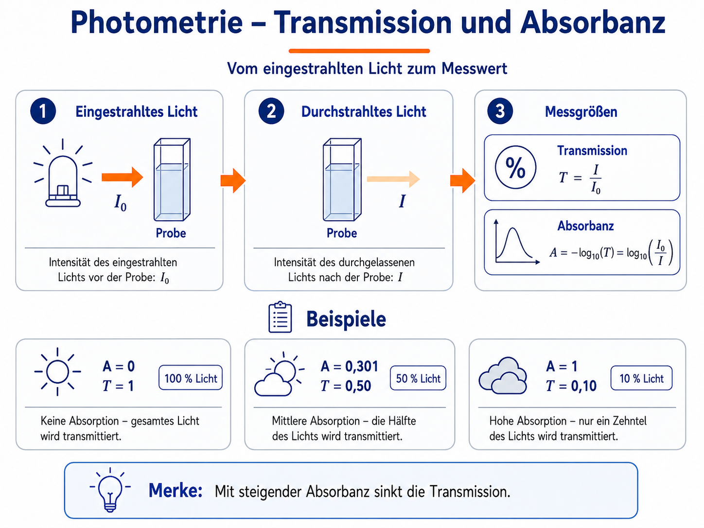

# Grundlagen der Photometrie

## Lichtabsorption als Messprinzip

Eine farbige Lösung erscheint farbig, weil sie bestimmte Bereiche des sichtbaren Lichts stärker absorbiert als andere. Das nicht absorbierte Licht wird durchgelassen oder gestreut und bestimmt den Farbeindruck.

Ein Photometer misst nicht direkt „die Farbe“, sondern vergleicht die eingestrahlte Lichtintensität \(I_0\) mit der durch die Probe gelangenden Intensität \(I\).

Die **Transmission** ist:

\[
T=\frac{I}{I_0}
\]

Häufig wird sie in Prozent angegeben:

\[
T_\% = 100\cdot\frac{I}{I_0}
\]

Die **Absorbanz** beziehungsweise Extinktion ist logarithmisch definiert:

\[
A=-\log_{10}(T)=\log_{10}\left(\frac{I_0}{I}\right)
\]

### Beispiele

| Absorbanz \(A\) | Transmission \(T\) | Durchgelassenes Licht |
|---:|---:|---:|
| 0 | 1 | 100 % |
| 0,301 | 0,50 | 50 % |
| 1 | 0,10 | 10 % |
| 2 | 0,01 | 1 % |

Die logarithmische Skala erklärt, warum ein Lichtstrahl bei hoher Absorbanz im Geräteschema sehr stark abgeschwächt erscheint.

## Lambert-Beer-Gesetz

Für verdünnte Lösungen und geeignete Bedingungen gilt näherungsweise:

\[
A=\varepsilon(\lambda)\cdot c\cdot d
\]

mit:

- \(A\): Absorbanz,
- \(\varepsilon(\lambda)\): wellenlängenabhängiger molarer Extinktionskoeffizient,
- \(c\): Stoffmengenkonzentration,
- \(d\): Schichtdicke der Küvette.

Daraus folgen drei zentrale Aussagen:

1. Bei fester Wellenlänge und Schichtdicke ist \(A\) proportional zu \(c\).
2. Bei fester Wellenlänge und Konzentration ist \(A\) proportional zu \(d\).
3. Die Empfindlichkeit hängt stark von der Wellenlänge ab.

!!! tip "Erste Erkundung"
    Im Spektrenmodus kann bei Kaliumpermanganat zuerst die Konzentration und danach die Schichtdicke verdoppelt werden. Im idealen linearen Bereich verdoppelt sich jeweils die Absorbanz, während die Lage der Absorptionsmaxima unverändert bleibt.

## Warum bei einem Maximum messen?

Eine Messung in der Nähe von \(\lambda_\text{max}\) hat meist Vorteile:

- hohe Empfindlichkeit,
- größere Absorbanzänderung pro Konzentrationsänderung,
- geringerer relativer Einfluss kleiner Wellenlängenabweichungen, wenn das Maximum breit genug ist.

Trotzdem ist \(\lambda_\text{max}\) nicht automatisch immer die beste Messwellenlänge. Bei sehr hohen Absorbanzen oder überlagerten Spektren kann eine andere Wellenlänge sinnvoller sein.

## Farbe der Lösung und absorbiertes Licht

Die beobachtete Farbe entspricht nicht der hauptsächlich absorbierten Farbe. Eine blaue Lösung absorbiert typischerweise stärker im orange-roten Bereich. Eine grüne Lösung kann gleichzeitig im blauvioletten und roten Bereich absorbieren und den grünen Spektralbereich relativ gut durchlassen.

Fast Green FCF zeigt diesen Zusammenhang besonders anschaulich: Das Modell enthält ein Band um etwa 423 nm und ein Hauptband um etwa 622 nm. Zwischen beiden Bereichen wird grünes Licht vergleichsweise gut durchgelassen.

<!-- ABBILDUNG GR-02 | DATEI: ../assets/images/analytik/photometer/gr02_farbe_absorption.svg | MOTIV: Spektralfarben-Leiste mit Beispielen: violette Permanganatlösung absorbiert grün; blaue Farbstofflösung absorbiert orange-rot; grüne Lösung absorbiert blauviolett und rot | ALT: Beispiele zum Zusammenhang zwischen Lösungsfarbe und absorbiertem Spektralbereich | PRIORITÄT: C | EINFÜGEN ALS:  -->

## Linearer Messbereich

Das Lambert-Beer-Gesetz gilt nicht unbegrenzt. Reale Abweichungen können entstehen durch:

- zu hohe Konzentration,
- Wechselwirkungen zwischen Teilchen,
- chemische Gleichgewichte,
- Streulicht,
- begrenzte Geräteauflösung,
- Trübung und Lichtstreuung,
- unpassenden Blindwert.

In der App werden hohe Absorbanzen sichtbar gewarnt. Im Fehlermodus kann Streulicht dazu führen, dass hohe Absorbanzwerte zu klein gemessen werden.

## Blindprobe und Nullabgleich

Die Blindprobe enthält alle Bestandteile außer dem zu bestimmenden absorbierenden Stoff. Sie berücksichtigt beispielsweise:

- Lösungsmittel,
- Reagenzien,
- Küvette,
- Grundabsorption des Systems.

Beim Nullabgleich wird das Signal der Blindprobe als Referenz gesetzt. Ein falscher Blindwert verschiebt anschließend die gesamte Messreihe systematisch.

## Spektrum und Einzelwellenlängenmessung

Ein **Spektrum** enthält viele Absorbanzwerte über einen Wellenlängenbereich. Eine **Eichkurvenmessung** erfolgt dagegen bei einer ausgewählten festen Wellenlänge.

| Spektrum | Einzelwellenlänge |
|---|---|
| zeigt Bandenform und Maxima | liefert einen quantitativen Messwert |
| hilft bei der Wellenlängenwahl | geeignet für Eichkurven |
| ermöglicht Stoffvergleiche | schneller und einfacher auszuwerten |

## Fachbegriffe in der App

| Begriff | Bedeutung |
|---|---|
| Scan | schrittweise Aufnahme eines Spektrums |
| Messwellenlänge | Wellenlänge der quantitativen Einzelmessung |
| Standard | Lösung mit bekannter Konzentration |
| unbekannte Probe | Probe, deren Konzentration bestimmt werden soll |
| Eichkurve | Zusammenhang zwischen Konzentration und Messsignal |
| Rohwert | direkt simulierter Messwert ohne fertige Interpretation |
| Residuum | Abweichung eines Messpunkts von der Regressionsgeraden |
| \(R^2\) | Maß für die Übereinstimmung der Punkte mit dem linearen Modell |

## Modell und Realität

SpektralLab abstrahiert:

- Die Lichtquelle wird als wählbare LED dargestellt.
- Komplexe Optik wird nicht gezeigt.
- Spektren werden aus parametrisierten Banden aufgebaut.
- Messfehler sind didaktisch dosiert.
- Kinetikverläufe werden zeitlich komprimiert wiedergegeben.

Diese Vereinfachungen dienen einer klaren fachlichen Beobachtung. Sie sollten im Unterricht ausdrücklich benannt werden.
