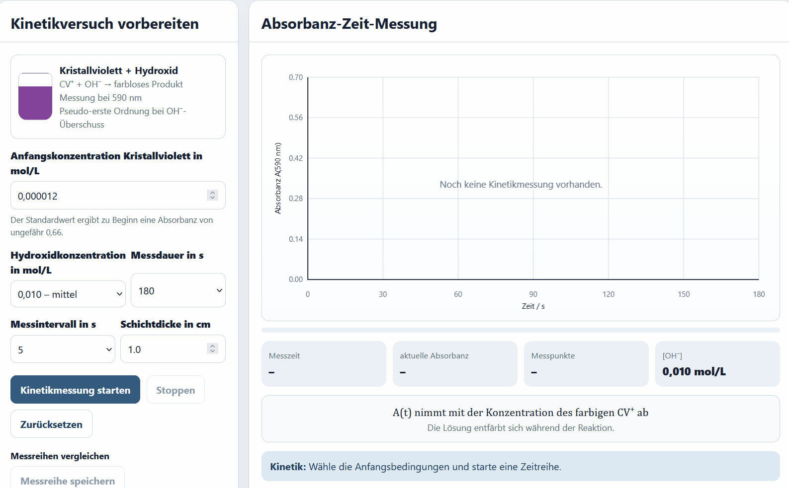
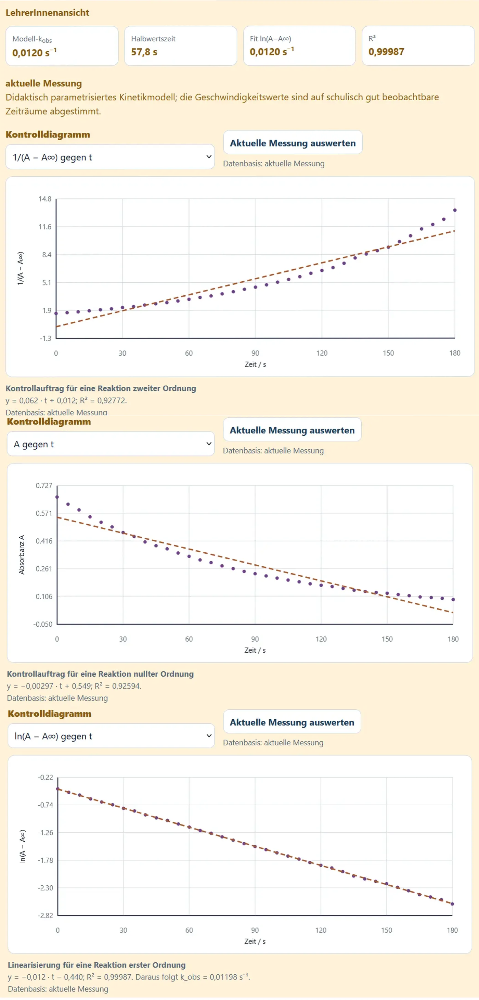
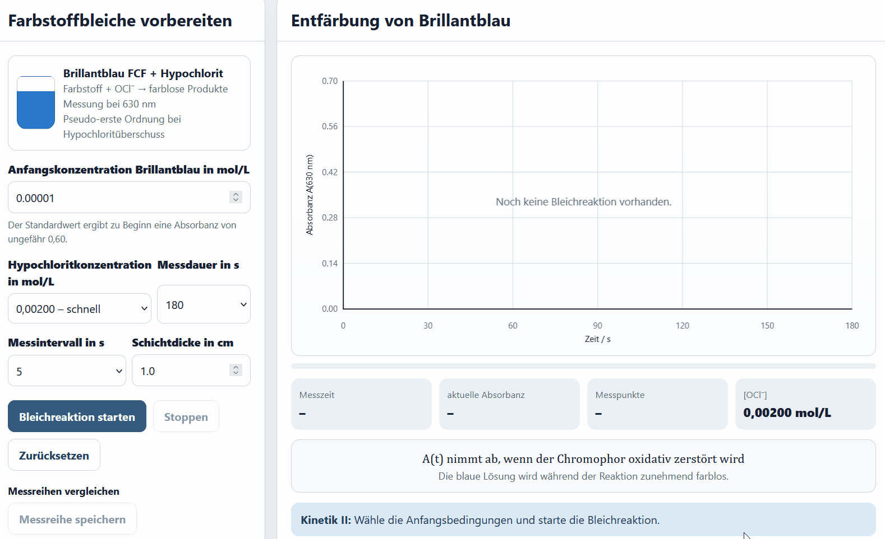
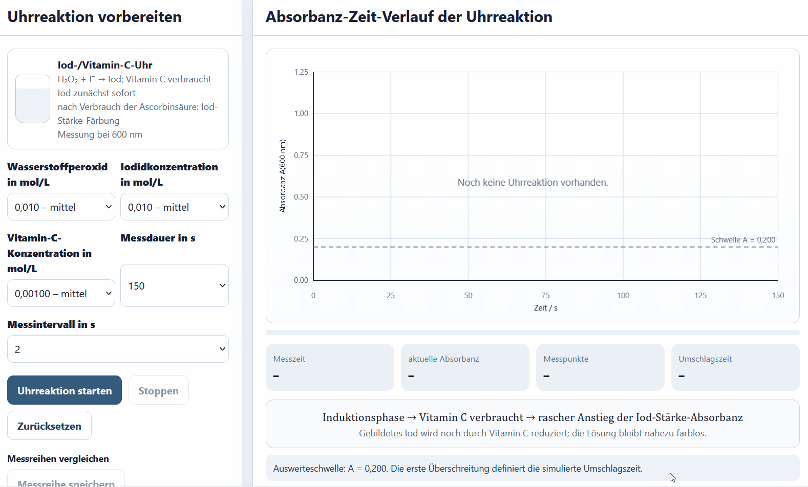

# Photometrische Kinetik

## Grundidee

Bei einer kinetischen Messung wird die Absorbanz bei einer festen Wellenlänge in regelmäßigen Zeitabständen aufgenommen. Ist die Absorbanz proportional zur Konzentration einer reagierenden farbigen Spezies, kann der Reaktionsverlauf quantitativ verfolgt werden.

SpektralLab enthält drei unterschiedliche Kinetiksysteme:

1. Kristallviolett + Hydroxid,
2. Brillantblau + Hypochlorit,
3. Iod-/Vitamin-C-Uhrreaktion.

{ loading=lazy }

## Gemeinsamer Ablauf

1. Reaktionssystem wählen.
2. Konzentrationen und Messintervall festlegen.
3. Messung starten.
4. Absorbanz-Zeit-Kurve beobachten.
5. Rohwerttabelle oder CSV exportieren.
6. Vergleichsläufe speichern.
7. Daten extern auswerten.

Die Wiedergabe im Browser ist beschleunigt. Die Achse und exportierten Daten zeigen die Modellzeit.

---

## 1. Kristallviolett und Hydroxid

### Reaktionsmodell

Bei großem Hydroxidüberschuss wird \([\mathrm{OH^-}]\) während eines Laufs als annähernd konstant behandelt. Die Abnahme des farbigen Kristallvioletts wird als pseudo-erste Ordnung modelliert:

\[
A(t)=A_\infty+(A_0-A_\infty)e^{-k_\mathrm{obs}t}
\]

Die Messung erfolgt bei 590 nm.

### Einstellbare Größen

- Anfangskonzentration von Kristallviolett,
- Hydroxidkonzentration,
- Schichtdicke,
- Messdauer,
- Messintervall.

### Reaktionsordnung prüfen

Die SchülerInnen vergleichen extern:

\[
A-A_\infty \text{ gegen } t
\]

\[
\ln(A-A_\infty) \text{ gegen } t
\]

\[
\frac{1}{A-A_\infty} \text{ gegen } t
\]

Für pseudo-erste Ordnung wird die logarithmische Auftragung linear. Die Steigung entspricht:

\[
m=-k_\mathrm{obs}
\]

Die LehrerInnenansicht kann jeweils ein Kontrolldiagramm mit Regression und \(R^2\) anzeigen.
{ loading=lazy }

### Hydroxidkonzentration vergleichen

Bis zu drei Läufe können gespeichert werden. Ein gespeicherter Lauf lässt sich im LehrerInnenmodus später als Auswertungsbasis anklicken.

<!-- ABBILDUNG KI-04 | DATEI: ../assets/images/analytik/photometer/ki04_gespeicherte_laeufe.webp | MOTIV: drei gespeicherte Kristallviolettläufe mit unterschiedlichen OH−-Konzentrationen; ein Lauf als Auswertungsbasis markiert | ALT: Auswahl gespeicherter Kinetikläufe für eine nachträgliche Auswertung | PRIORITÄT: B | EINFÜGEN ALS: { loading=lazy } -->

---

## 2. Brillantblau und Hypochlorit

### Chemischer Kontext

Hypochlorit verändert das Chromophor des Farbstoffs. Die sichtbare blaue Farbe nimmt ab. Die Entfärbung bedeutet nicht automatisch vollständige Mineralisierung.

Gemessen wird bei 630 nm. Hypochlorit liegt im Modell im Überschuss vor, sodass ebenfalls eine pseudo-erste Ordnung untersucht werden kann.

### Einstellbare Größen

- Brillantblaukonzentration,
- Hypochloritkonzentration,
- Schichtdicke,
- Messdauer,
- Messintervall.

### Auswertungen

- passende Reaktionsordnung bezüglich des Farbstoffs,
- \(k_\mathrm{obs}\),
- Vergleich verschiedener Hypochloritkonzentrationen,
- Auftragung von \(k_\mathrm{obs}\) gegen \([\mathrm{OCl^-}]\),
- Diskussion der Überschussbedingung.

---

## 3. Iod-/Vitamin-C-Uhrreaktion

### Prinzip

In der Uhrreaktion wird gebildetes Iod zunächst durch Vitamin C reduziert. Solange Vitamin C vorhanden ist, bleibt die Absorbanz gering. Nach dessen Verbrauch akkumulieren Iod beziehungsweise Triiodid und bilden mit Stärke eine intensive Färbung.

Das Signal zeigt daher:

1. Induktionsphase,
2. raschen Anstieg,
3. Überschreiten einer definierten Absorbanzschwelle.

Gemessen wird modellhaft bei 600 nm.

### Einstellbare Größen

- Wasserstoffperoxidkonzentration,
- Iodidkonzentration,
- Vitamin-C-Konzentration,
- Messdauer,
- Messintervall.

### Umschlagszeit

Die App verwendet als Auswerteschwelle:

\[
A=0{,}200
\]

Die Zeit bis zum Überschreiten wird als Umschlagszeit bestimmt.

Als vereinfachtes Geschwindigkeitsmaß kann verwendet werden:

\[
\frac{1}{t_\mathrm{Umschlag}}
\]

!!! warning "Interpretation"
    \(1/t\) ist keine momentane Reaktionsgeschwindigkeit. Es dient als schulisch vereinfachter Vergleichswert, wenn bis zum Umschlag eine definierte Stoffmenge umgesetzt wurde.

<!-- ABBILDUNG KI-07 | DATEI: ../assets/images/analytik/photometer/ki07_uhr_schwelle.webp | MOTIV: LehrerInnen-Kontrolldiagramm der Uhrreaktion mit horizontaler Schwellenlinie A=0,200 und markierter Umschlagszeit | ALT: Bestimmung der Umschlagszeit über eine Absorbanzschwelle | PRIORITÄT: B | EINFÜGEN ALS: { loading=lazy } -->

---

## Rohwerttabellen

Die Tabellen sind standardmäßig eingeklappt. Ihre Überschrift zeigt die Zahl der aufgenommenen Messwerte. Der CSV-Export ist unabhängig vom Tabellenzustand verfügbar.

## Aufgaben in der App

### Kristallviolett

- `KI-CV-01`: Reaktionsordnung bestimmen,
- `KI-CV-02`: Einfluss der Hydroxidkonzentration.

### Brillantblau

- `KI-BB-01`: Reaktionsordnung der Farbstoffbleiche,
- `KI-BB-02`: Einfluss der Hypochloritkonzentration.

### Uhrreaktion

- `KI-UHR-01`: Umschlagszeit bestimmen,
- `KI-UHR-02`: Konzentrationseinfluss untersuchen.

## Modellgrenzen

- ideale Durchmischung,
- keine Totzeit beim Start,
- konstante Temperatur,
- didaktisch parametrisierte Geschwindigkeitswerte,
- keine vollständigen Mechanismen,
- Zeitkompression in der Animation,
- vereinfachte Restabsorbanz.

Die Modelle eignen sich zur Untersuchung von Datenmustern und Auswertungsverfahren, nicht zur Übernahme von Literaturkonstanten.
