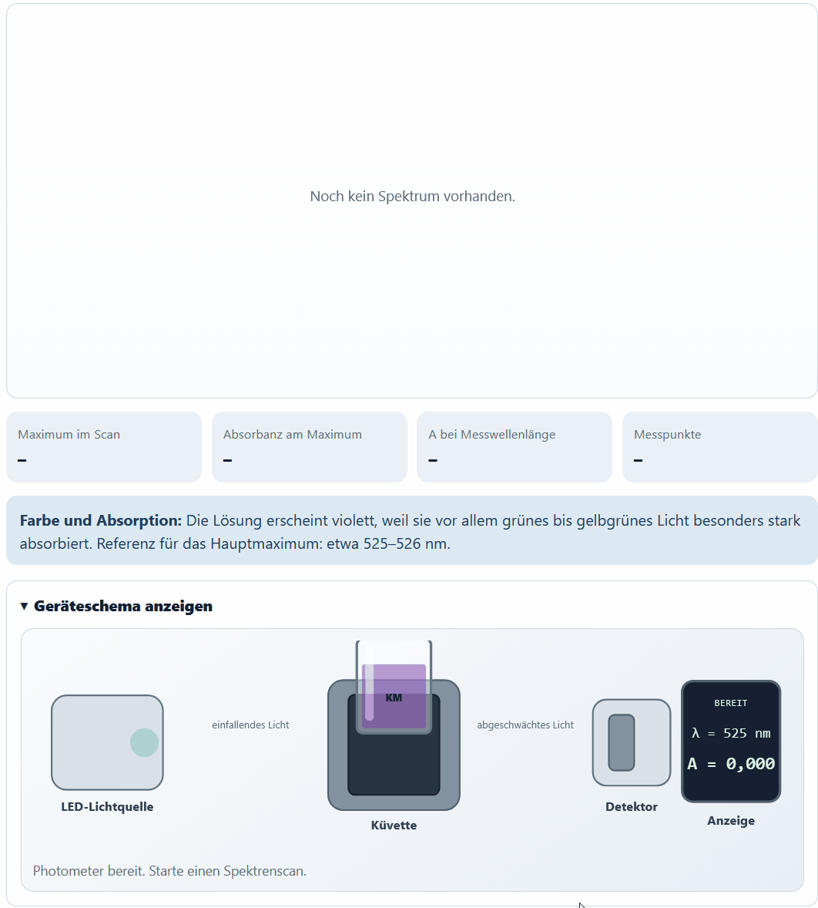
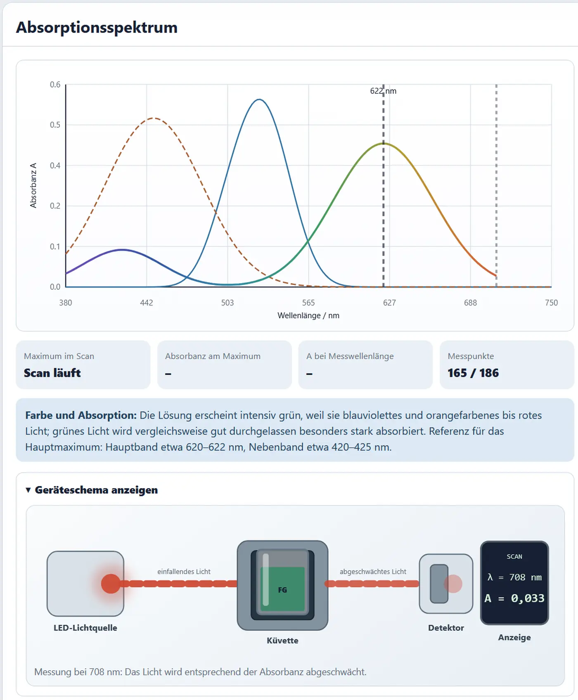

# Absorptionsspektren aufnehmen und vergleichen

## Ziel

Im Spektrenmodus wird die Absorbanz einer farbigen Lösung über einen Wellenlängenbereich aufgenommen. Die Kurve wächst sichtbar von niedrigen zu hohen Wellenlängen. Parallel zeigt das schematische Photometer die aktuelle Lichtfarbe und ihre Abschwächung.

## Verfügbare Lösungen

| Lösung | Farbe | charakteristischer Bereich | Standard-Messwellenlänge |
|---|---|---|---:|
| Kaliumpermanganat | violett | strukturiertes Hauptband um 525 nm | 525 nm |
| Kupfer(II)-sulfat | hellblau | breites schwaches Band bis in den nahen IR-Bereich | 750 nm |
| Tetraamminkupfer(II) | tiefblau | breites Band um 620 nm | 620 nm |
| Eisen(III)-thiocyanat | rot bis orange-rot | Band um 447 nm | 447 nm |
| Brillantblau FCF | intensiv blau | Hauptband um 629 nm, Nebenband im violetten Bereich | 630 nm |
| Fast Green FCF | intensiv grün | Banden um 423 und 622 nm | 622 nm |

!!! note "Modellhinweis"
    Die Bandenlagen orientieren sich an publizierten Werten. Peakbreiten und Intensitäten sind für die schulische Visualisierung parametrisiert.

## Ein erstes Spektrum aufnehmen

1. **Spektrum** öffnen.
2. Kaliumpermanganat wählen.
3. Standardkonzentration und Schichtdicke zunächst unverändert lassen.
4. Beobachtungsmodus für die Scan-Geschwindigkeit wählen.
5. **Spektrum scannen** anklicken.
6. Farbänderung des Lichtstrahls und Abschwächung beobachten.
7. Lage und Form des Maximums beschreiben.
8. Messwellenlänge auf das Maximum setzen.

## Scan-Geschwindigkeit

Es stehen zwei Geschwindigkeiten zur Verfügung:

- **Normal:** etwa fünf Sekunden,
- **Beobachtungsmodus:** etwa acht Sekunden.

Der Beobachtungsmodus eignet sich für die gemeinsame Projektion und die erste Auseinandersetzung mit Lichtfarbe und Absorption.

## Konzentration und Schichtdicke variieren

Die App erlaubt eine direkte Prüfung des Lambert-Beer-Gesetzes.

### Konzentration

- Konzentration verdoppeln,
- erneut scannen,
- Höhe der Kurve vergleichen,
- Lage der Maxima prüfen.

### Schichtdicke

- Konzentration zurücksetzen,
- Schichtdicke verdoppeln,
- erneut scannen,
- Kurvenhöhe vergleichen.

Erwartung im idealen Bereich:

- Absorbanz steigt proportional,
- charakteristische Bandenlage bleibt gleich.

## Spektren speichern und überlagern

Bis zu drei Spektren können gespeichert werden. Sinnvolle Vergleiche:

- ein Stoff bei drei Konzentrationen,
- Kaliumpermanganat und Eisen(III)-thiocyanat,
- Kupfer(II)-Aquoion und Tetraamminkupfer(II),
- Brillantblau und Fast Green.

{ loading=lazy }

## Didaktisch ergiebige Stoffvergleiche

### Kupfer(II)-Aquoion und Tetraamminkupfer(II)

Beide Lösungen enthalten Kupfer(II), besitzen aber unterschiedliche Ligandenumgebungen. Die deutliche Änderung von Farbe und Spektrum zeigt, dass die absorbierenden Eigenschaften nicht nur vom Metallion abhängen.

Leitfragen:

- Warum unterscheiden sich die Banden trotz gleichem Zentralion?
- Welcher Spektralbereich wird bevorzugt absorbiert?
- Wie hängt die beobachtete Farbe mit dem Spektrum zusammen?

### Brillantblau und Fast Green

Beide sind intensive synthetische Farbstoffe. Fast Green zeigt zwei sichtbare Banden und lässt den grünen Bereich relativ gut passieren.

<!-- ABBILDUNG SP-03 | DATEI: ../assets/images/analytik/photometer/sp03_fast_green.webp | MOTIV: Fast-Green-Spektrum mit markiertem Nebenband um 423 nm und Hauptband um 622 nm; grüne Lösungsvorschau sichtbar | ALT: Zweibandiges sichtbares Spektrum von Fast Green FCF | PRIORITÄT: B | EINFÜGEN ALS: { loading=lazy } -->

### Permanganat und Eisen(III)-thiocyanat

Die violette und die rot-orange Lösung absorbieren in unterschiedlichen Bereichen. Dieser Vergleich eignet sich gut zur Einführung komplementärer Farbeindrücke.

## Messwellenlänge auswählen

Nach dem Scan kann eine Messwellenlänge markiert werden. Die App zeigt den zugehörigen Absorbanzwert und stellt denselben Punkt im Geräteschema dar.

Leitfragen:

- Liegt die gewählte Wellenlänge am Maximum?
- Wie stark ändert sich \(A\), wenn die Wellenlänge leicht verschoben wird?
- Ist der Messwert für eine Eichkurve zu klein oder zu groß?

## Beobachtungsaufträge

### Basis

- Bestimme \(\lambda_\text{max}\).
- Beschreibe die Lösungsfarbe.
- Nenne den bevorzugt absorbierten Spektralbereich.
- Vergleiche zwei Konzentrationen.

### Vertiefung

- Vergleiche Bandenbreite und Bandenform.
- Begründe die Wahl einer Messwellenlänge.
- Erkläre, warum Fast Green grün erscheint.
- Vergleiche zwei Kupfer(II)-Systeme.

## Typische Fehlvorstellungen

!!! warning "Nicht verwechseln"
    - Die Farbe des Lichtstrahls entspricht der **eingestellten Wellenlänge**.
    - Die Farbe der Lösung entspricht dem **resultierenden Farbeindruck**.
    - Ein Absorptionsmaximum liegt häufig gerade nicht im Farbbereich, in dem die Lösung erscheint.

## Grenzen

- Die App zeigt nur den sichtbaren und teilweise angrenzenden Bereich.
- Lösungsmittel- und Temperaturabhängigkeiten werden nicht vollständig modelliert.
- Chemische Gleichgewichte sind bei den statischen Stoffen als feste Bedingungen vorgegeben.
- Trübung und Streuung werden im Spektrenmodus nicht als eigener Versuchsparameter behandelt.
