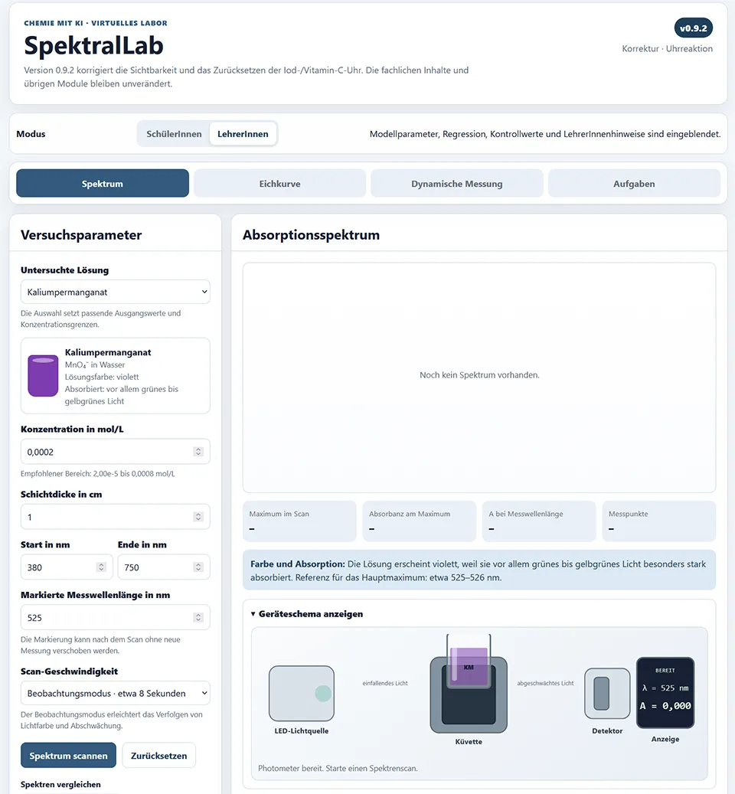

# SpektralLab – Virtuelles Photometer

**SpektralLab** ist ein browserbasiertes virtuelles Photometer für den Chemieunterricht. Die Anwendung verbindet die Aufnahme sichtbarer Absorptionsspektren mit Eichkurven, unbekannten Proben, einer realistischen Fehlerkultur, pH-abhängigen Spektren und drei ausgewählten Kinetikversuchen.

[SpektralLab – Virtuelles Photometer öffnen](https://ekerzendorfer.github.io/VIRTUELLES_PHOTOMETER/){ .md-button .md-button--primary }

{ loading=lazy }

## Warum ein virtuelles Photometer?

Photometrie ist für den Chemieunterricht besonders attraktiv: Ein sichtbarer Farbeindruck wird mit einer quantitativen Messgröße verbunden. In der Praxis stehen jedoch häufig nicht genügend Geräte für mehrere SchülerInnengruppen zur Verfügung. Reale Messungen müssen außerdem vorbereitet, betreut und innerhalb einer begrenzten Unterrichtszeit ausgewertet werden.

Die App ersetzt reale Experimente nicht. Sie bietet vielmehr eine zusätzliche Möglichkeit,

- Messabläufe vor einem Laborversuch zu üben,
- Messreihen ohne Geräteengpass durchzuführen,
- typische Fehler gezielt zu untersuchen,
- anspruchsvollere Spektren- und Kinetikaufgaben vorzubereiten,
- Rohdaten für eine externe Auswertung bereitzustellen.

!!! info "Didaktischer Grundsatz"
    **Die App misst – die SchülerInnen werten aus.**  
    Diagramme, Rechnungen, Interpretation und Fehlerdiskussion bleiben Bestandteile eines externen Protokolls. Die SchülerInnenansicht zeigt daher bewusst nicht alle Kontrollwerte.

## Vier Hauptbereiche

### Spektrum

Im Spektrenmodus wird ein sichtbares Absorptionsspektrum von niedrigen zu hohen Wellenlängen aufgenommen. Ein schematisches Photometer zeigt gleichzeitig,

- die Farbe des eingestrahlten Lichts,
- die farbige Probe,
- die Abschwächung hinter der Küvette,
- den aktuellen Messwert.

Bis zu drei Spektren können gespeichert und überlagert werden.

### Eichkurve

Der Eichkurvenmodus bildet einen vollständigen schulischen Messablauf ab:

1. Stoff und Messwellenlänge wählen,
2. Standards vorbereiten,
3. Blindprobe messen,
4. Standards einzeln oder mehrfach messen,
5. unbekannte Probe aufnehmen,
6. Rohdaten exportieren und extern auswerten.

Eine moderate Messstreuung ist immer aktiv. Lern- und Diagnosemodus ergänzen gezielt Laborprobleme.

### Dynamische Messung

Der dynamische Bereich enthält:

- pH-abhängige Spektren von Bromthymolblau,
- Entfärbung von Kristallviolett mit Hydroxid,
- Entfärbung von Brillantblau mit Hypochlorit,
- Iod-/Vitamin-C-Uhrreaktion.

Die fortgeschrittenen Module verzichten bewusst auf das Geräteschema, damit die fachliche Auswertung im Mittelpunkt bleibt.

### Aufgaben

Vierzehn kuratierte Aufgaben führen durch Spektren, Eichkurven, Fehlerdiagnose, Gleichgewicht und Kinetik. Sie sind als **geführt**, **teiloffen** oder **offen** gekennzeichnet.

<!-- ABBILDUNG VP-02 | DATEI: ../assets/images/analytik/photometer/vp02_hauptnavigation.webp | MOTIV: vergrößerter Ausschnitt der vier Hauptbereiche und der Umschaltung SchülerInnen/LehrerInnen | ALT: Hauptnavigation von SpektralLab mit vier Messbereichen und Moduswahl | PRIORITÄT: B | EINFÜGEN ALS: { loading=lazy } -->

## Zielgruppen und mögliche Einsatzformen

| Zielgruppe | Geeignete Module |
|---|---|
| SEK I | Farbe und Absorption, schematisches Gerät, einfache Spektrenvergleiche |
| SEK II | Lambert-Beer-Gesetz, Eichkurven, unbekannte Proben, Fehlerdiagnose |
| Wahlpflichtfach | offene Messplanung, Spektrenüberlagerung, pH-abhängige Spektren |
| Chemieolympiade | Reaktionsordnung, Konzentrationseinflüsse, anspruchsvolle Fehleranalyse |
| Studieneingang | Wiederholung von UV/Vis-Grundlagen, Regression und integrierten Zeitgesetzen |

## Empfohlener Lernweg

Ein möglicher Aufbau über mehrere Unterrichtseinheiten:

1. **Gerät und Spektrum:** Kaliumpermanganat scannen und Lichtfarbe beobachten.
2. **Lambert-Beer:** Konzentration und Schichtdicke variieren.
3. **Eichkurve:** Standards und unbekannte Probe messen.
4. **Fehlerkultur:** eine problematische Eichreihe diagnostizieren.
5. **Gleichgewicht:** Bromthymolblau bei pH 4, 7 und 10 vergleichen.
6. **Kinetik:** Kristallviolett oder Brillantblau als Absorbanz-Zeit-Versuch.
7. **Vertiefung:** Uhrreaktion und offene Aufgaben.

<!-- ABBILDUNG VP-03 | DATEI: ../assets/images/analytik/photometer/vp03_lernweg.svg | MOTIV: selbst erstellte Infografik mit dem Lernweg Gerät → Spektrum → Eichkurve → Fehler → Gleichgewicht → Kinetik | ALT: Lernweg durch die Module des virtuellen Photometers | PRIORITÄT: B | EINFÜGEN ALS:  -->

## Technische Voraussetzungen

- aktueller Desktop- oder Tablet-Browser,
- JavaScript aktiviert,
- keine Installation,
- keine Anmeldung,
- keine Serververbindung für die Berechnung,
- CSV- und Markdown-Downloads über den Browser.

Die Anwendung speichert ausgewählte Einstellungen und Vergleichsläufe lokal im Browser. Mit **Zurücksetzen** können die jeweiligen Module in ihren Ausgangszustand versetzt werden.

## Modellcharakter

Die Spektren und Reaktionsverläufe sind didaktisch parametrisierte Modelle. Sie orientieren sich an publizierten Bandenlagen und etablierten Schulversuchen, bilden aber kein bestimmtes reales Gerät oder vollständiges Literaturprotokoll exakt nach.

!!! warning "Wichtig"
    Modellkurven können Zusammenhänge deutlich machen, dürfen aber nicht mit Referenzdaten für analytische Laborarbeit verwechselt werden.

## Weiterführende Seiten

- [Grundlagen der Photometrie](photometrie-grundlagen.md)
- [Das schematische Photometer](photometer-geraeteschema.md)
- [Spektren aufnehmen](photometrie-spektren.md)
- [Eichkurven und unbekannte Proben](photometrie-eichkurven.md)
- [Messrealismus und Fehlerkultur](photometrie-fehlerkultur.md)
- [pH-abhängige Spektren](photometrie-gleichgewicht.md)
- [Photometrische Kinetik](photometrie-kinetik.md)
- [Aufgaben und Protokoll](photometrie-aufgaben-protokoll.md)
- [Datenexport und Weiterverarbeitung](photometrie-datenexport.md)
