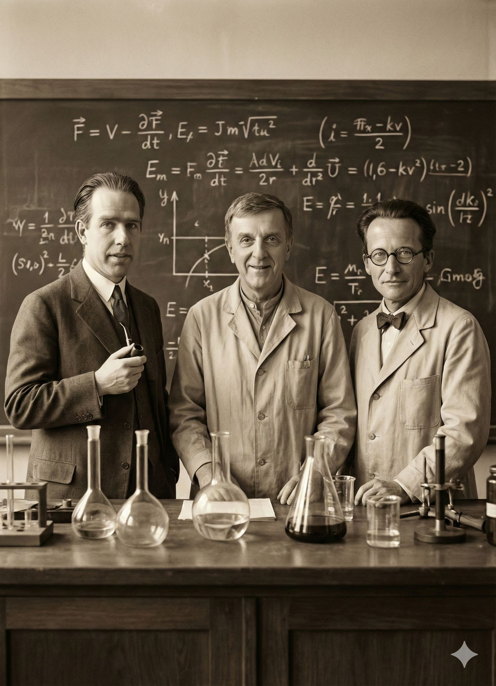

# Willkommen zum Begleitkurs: CHEMIE mit KI

Herzlich willkommen auf der digitalen Begleitplattform zu meiner neuen Artikelserie! Hier finden Sie alle praxisnahen Anleitungen, Prompts und Tools, um die Theorie aus dem Heft direkt in Ihren Unterrichtsalltag zu integrieren.

---

## 👨‍🏫 Über den Autor & die Motivation

Mein Name ist Erich Kerzendorfer. Ich beschäftige mich seit vielen Jahren leidenschaftlich mit der Frage, wie digitale Medien den naturwissenschaftlichen Unterricht bereichern können. 

Schon 2015 habe ich in meiner Artikelserie zum computergestützten Unterricht ein Credo formuliert, das heute im Zeitalter der Künstlichen Intelligenz (KI) mehr denn je gilt: **Der Computer oder andere digitale Medien sollen und dürfen das reale Experiment nicht ersetzen.** Sie können aber als hochintelligente Assistenten dienen! Die Werkzeuge, die ich Ihnen hier vorstelle, sollen die Unterrichtsvorbereitung massiv erleichtern, die Erkennbarkeit chemischer Phänomene verbessern und den SchülerInnen ein individuelles, motivierendes Üben mit sofortigem Feedback ermöglichen. Kurz gesagt: Die KI soll uns Lehrkräften wertvolle Zeit für das Wesentliche – das Labor und die pädagogische Führung – zurückgeben.

{ width="25%" } { width="40%" } { width="25%" }

Von links nach rechts: Der Autor | KI-Montage "KI-Sucht" | KI: "Mit Arbeitskollegen im Labor"

---

## 🗂️ Der Linkhub: Alle Werkzeuge auf einen Blick

Um Ihnen die Suche nach den richtigen Adressen zu ersparen, dient diese Seite auch als zentraler **Linkhub**. Hier finden Sie alle webbasierten Apps und KI-Tools, die in der Artikelserie besprochen werden, an einem Ort gebündelt. Alle hier verlinkten Eigenentwicklungen sind kostenlos, werbefrei und ohne Installation auf jedem Endgerät nutzbar.

* [LINKHUB - alle Apps auf einen Blick](https://ekerzendorfer.github.io/CHEMIE_KI_LINKS/index.html)
* [Interaktives Periodensystem (PSE-Trainer)](DEIN_LINK_HIER)
* [Salzformeln & Nomenklatur-Trainer](DEIN_LINK_HIER)
* [Stöchiometrie - Master PRO](DEIN_LINK_HIER)
* [Gleichungstrainer PRO (Die Freistunden-App)](DEIN_LINK_HIER)

Nutzen Sie das Menü auf der linken Seite, um zu den detaillierten didaktischen Einsatzszenarien und den Schritt-für-Schritt-Anleitungen zu gelangen!

---

## 📊 Präsentations-Material (Slides)

Sie möchten die Inhalte der Artikelserie in einer Fachkonferenz an Ihrer Schule vorstellen oder das Thema in einem Seminar aufgreifen? 

Hier können Sie sich meine dazugehörige Präsentation ansehen oder direkt herunterladen. Sie enthält alle wesentlichen Kernpunkte, visualisierte Workflows und die passenden QR-Codes für Ihre KollegInnen.

[Präsentation ansehen](https://docs.google.com/presentation/d/1toaHCfHsOgpVb6t9SOg1yU2f6O_3G723OjRU5sdgrd8/edit?usp=sharing){ .md-button .md-button--primary } 

[Präsentation als PDF herunterladen](DEIN_LINK_HIER){ .md-button }

## Der KI-Kompass: Wo fange ich am besten an?

Wenn Sie sich gerade fragen: *"ChatGPT, Claude, Gemini, NotebookLM – wo fange ich eigentlich an und welches Tool ist das beste?"*, dann sind Sie nicht allein. Der aktuelle Markt kann anfangs absolut überwältigend wirken. 

Die wichtigste Erkenntnis vorweg: Es gibt nicht die "eine perfekte" KI. Vielmehr ist es wie bei einem gut sortierten Werkzeugkoffer in der Chemie-Sammlung – für jede Aufgabe gibt es das passende Spezialwerkzeug. Ob Sie ein komplexes PDF auswerten, einen Lückentext differenzieren oder sogar eine kleine Web-App für Ihre SchülerInnen bauen möchten: Je nach Zielsetzung glänzt ein anderes Modell. 

Um Ihnen den Einstieg zu erleichtern, finden Sie hier eine objektive und kompakte Übersicht der aktuell relevantesten KIs für den naturwissenschaftlichen Unterricht:

??? info "Aufklappen: Übersicht – Welche KI für welchen Zweck?"
    **Die wichtigsten KI-Tools für NaWi-Lehrkräfte im direkten Vergleich**

    | KI-Plattform (Kosten) | Größter Vorteil für NaWi-Lehrkräfte | Warum das so ist (Der konkrete Anwendungsfall) |
    | :--- | :--- | :--- |
    | **Claude 3.5 Sonnet** *(Basis kostenlos / Pro ca. 22€)* | **Der App-Baumeister & Didaktiker** Überragend im Programmieren und bei Fachtexten. | Bietet "Artifacts" (Vorschaufenster für Code). Perfekt, um in Freistunden eigene interaktive HTML-Apps (wie den Gleichungstrainer) zu bauen. Formuliert Arbeitsblätter sprachlich extrem natürlich. |
    | **ChatGPT (OpenAI)** *(Basis kostenlos / Plus ca. 22€)* | **Der Analytiker & Allrounder** Stark in Logik, Mathematik und Bildanalyse. | Kann hochgeladene Fotos von Versuchsplänen, handschriftlichen Formeln oder Diagrammen (z.B. Titrationskurven) exzellent auslesen. Bietet in der Bezahlversion maßgeschneiderte "Custom GPTs". |
    | **Google Gemini** *(Basis kostenlos / Advanced ca. 22€)* | **Der Rechercheur** Echtzeit-Internetzugriff und YouTube-Integration. | Greift nahtlos auf das aktuelle Netz zu (gut für tagesaktuelle wissenschaftliche Daten). Kann YouTube-Videos von chemischen Experimenten analysieren und zusammenfassen. |
    | **Google NotebookLM** *(Komplett kostenlos)* | **Der sichere Archivar** Arbeitet komplett ohne "Halluzinationen". | Beantwortet Fragen *ausschließlich* auf Basis Ihrer eigenen Dokumente (z.B. Lehrpläne, Sicherheitsdatenblätter). Erfindet keine chemischen Fakten dazu. |
    | **HuggingChat / Poe.com** *(Kostenlos nutzbar)* | **Der Schüler-Tutor** Eigene Assistenten ohne Abo-Zwang. | Ideal, um maßgeschneiderte Lern-Bots (z.B. einen "Redox-Coach") mit didaktischen Regeln zu füttern und den Link datenschutzfreundlich an die Klasse zu verteilen. |
