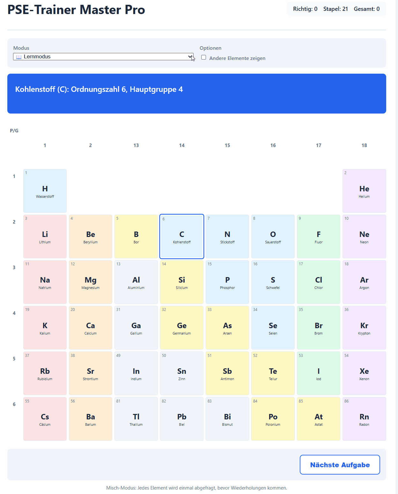
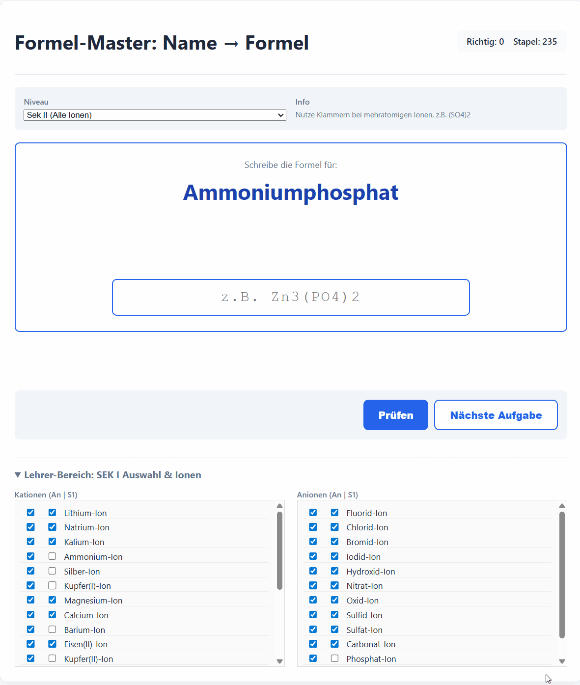
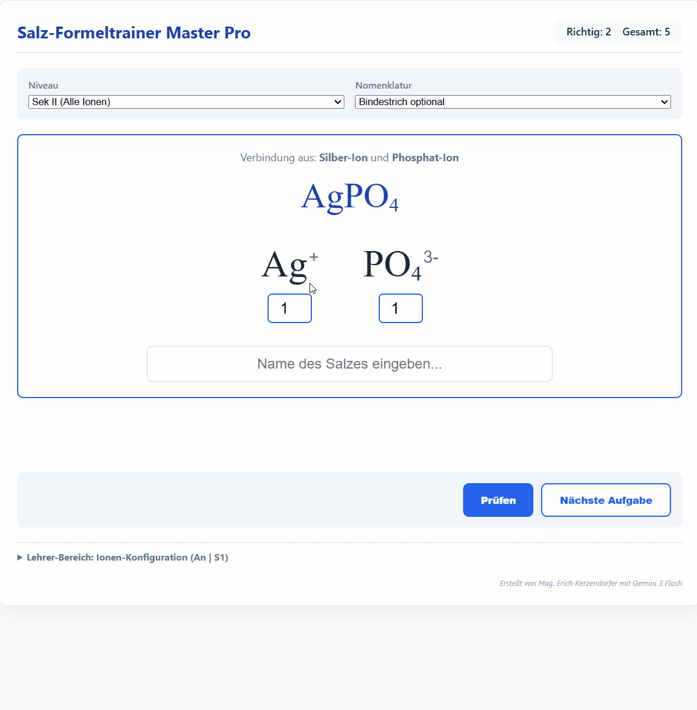
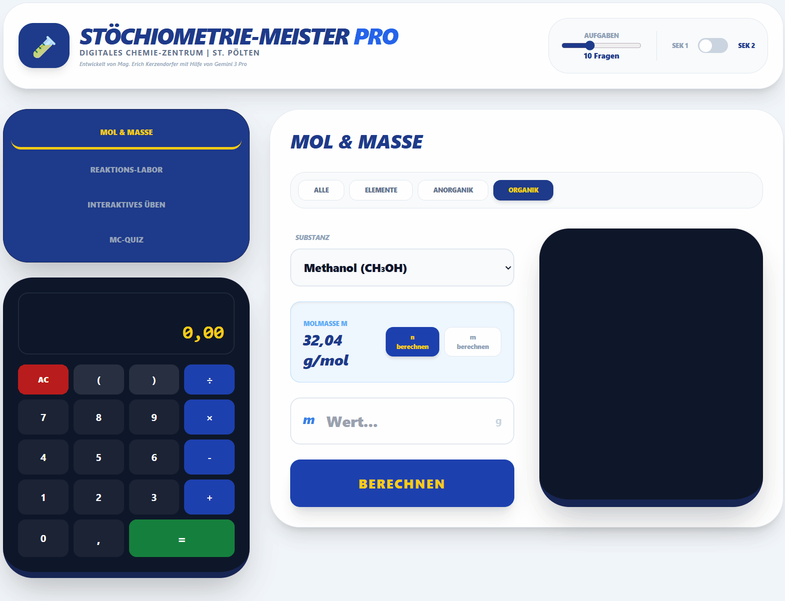

# Kapitel 2: Sofort einsetzbare Basis-Tools

Der eigentliche Mehrwert der Digitalisierung entsteht, wenn wir den SchülerInnen Werkzeuge an die Hand geben, die sie beim Erwerb chemischer Basiskompetenzen unterstützen. 

Die folgenden browserbasierten Tools können Sie **sofort, kostenlos und ohne Installation** auf jedem Endgerät (Smartphone, Tablet, PC) in Ihrem Unterricht einsetzen. Ein einfacher QR-Code am Beamer genügt!

---

## 🧪 1. Interaktives Periodensystem (PSE-Trainer)

Die Kenntnis der wichtigsten Elemente und ihrer Position im PSE ist eine fundamentale Kulturtechnik in der Chemie. Dieser Trainer fragt Elementnamen und -symbole interaktiv ab.

[Zur App: PSE-Trainer starten](https://ekerzendorfer.github.io/PERIODENSYTEM/){ .md-button .md-button--primary }

!!! success "Didaktischer Einsatz: Der Misch-Modus"
    Viele Standard-Quiz-Apps nutzen einfache Zufallsgeneratoren, was oft zu Frustration führt, weil manche Elemente dreimal und andere gar nicht abgefragt werden. Der PSE-Trainer nutzt einen speziellen **Misch-Modus**: Jedes Element aus dem gewählten Pool wird exakt einmal abgefragt, bevor Wiederholungen auftreten. Das sorgt für ein systematisches und faires Festigen der Grundlagen.

??? tip "Kurzanleitung: So wechseln Sie den Abfrage-Modus (Video)"
    Hier sehen Sie, wie einfach sich der Schwierigkeitsgrad für Ihre Klasse anpassen lässt:
    
    
---

## 🧂 2. Salzbenennung & Salzformeln (Formel-Master)

Das Übersetzen von Stoffnamen in die korrekte chemische Formelsprache ist eine der größten Hürden in der anorganischen Chemie.

[Salz - Formeltrainer](https://ekerzendorfer.github.io/SALZFORMELN/){ .md-button .md-button--primary } [Salz - Benennung](https://ekerzendorfer.github.io/SALZBENENNUNG/){ .md-button }

!!! tip "Fokus auf die Nomenklatur-Schnittstelle"
    Das Tool trainiert genau den korrekten Umgang mit Ionenladungen, tiefgestellten Indizes und der richtigen Setzung von Klammern bei mehratomigen Ionen (z.B. bei Sulfaten oder Nitraten). Über einen speziellen Lehrer-Bereich können Sie gezielt steuern, welche Ionenkonfigurationen (z.B. nur einfache Anionen für die Sek 1) abgefragt werden.

??? tip "Kurzanleitung: Bei gegebenen Salznamen die Formel ermitteln (Video)"
    Schwierigkeitsgrad (SEK1/2) einstellen, Anpassung im Lehrerbereich (unten):
    
    

??? tip "Kurzanleitung: Bei gegebener Salznformel den Namen ermitteln (Video)"
    Indices korrekt einstellen und Namen eingeben, Schwierigkeitsgrad SEK1/2 auswählen:
    
    
---

## 🧮 3. Stöchiometrie - Master PRO

Dieses digitale "Chemie-Zentrum" bündelt Aufgaben zur molaren Masse, Stoffmengenberechnungen und Reaktionsumsätzen und macht die abstrakte Größe "Mol" greifbar.

[Zur App: Stöchiometrie-Master starten](https://ekerzendorfer.github.io/STOECHIOMETRIE/){ .md-button .md-button--primary }

!!! abstract "Gamification & Eigenständigkeit"
    Die App bietet zielgruppenspezifische Module für die Sekundarstufe 1 und 2. Der große Vorteil: Durch sofortige Rückmeldungen zur Richtigkeit der Ergebnisse (Score-Tracking) wird der Gamification-Aspekt bedient. Die SchülerInnen sind motiviert, ihre Fehler eigenständig zu finden und zu korrigieren, was die Lehrkraft bei Übungsphasen enorm entlastet.

??? tip "Kurzanleitung: Stöchiometrisches Rechnen in 4 Variationen (Video)"
   Stoffmenge und Masse berechnen, Reaktionsumsätze, Übungsbeispiele und Quiz:

   
