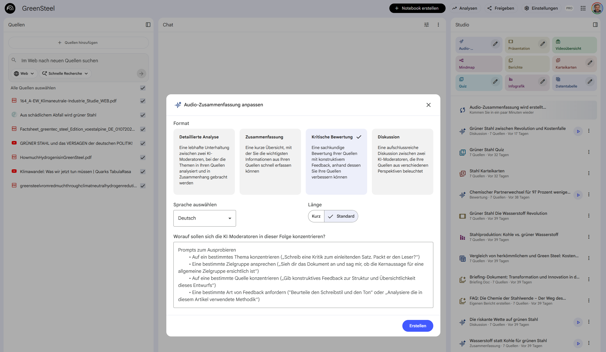

# NotebookLM: Ihr digitaler, halluzinationsfreier Aktenkoffer

Das wohl größte Problem allgemeiner KI-Chatbots im naturwissenschaftlichen Unterricht ist die fehlende fachliche Zuverlässigkeit. Wenn die KI pKs-Werte erfindet oder komplexe Reaktionsmechanismen falsch wiedergibt (sogenannte "Halluzinationen"), ist sie für uns unbrauchbar. 

Hier bietet das kostenlose Tool **NotebookLM** von Google einen echten Paradigmenwechsel. Es arbeitet nach dem Prinzip des *Source-Groundings*. 

!!! info "Was bedeutet Source-Grounding?"
    Stellen Sie sich NotebookLM wie einen digitalen Aktenkoffer vor. Sie legen dort Ihre eigenen verifizierten PDFs, Skripten oder Weblinks hinein. Wenn Sie der KI nun eine Frage stellen oder einen Arbeitsauftrag erteilen, sucht sie die Antwort **ausschließlich** in diesen hochgeladenen Dokumenten. Sie erfindet keine Fakten hinzu.

## 🔬 Drei geniale Einsatzszenarien für den Chemieunterricht

NotebookLM entfaltet seine wahre Stärke bei der Unterrichtsvorbereitung und der Materialerstellung. Hier sind drei Beispiele, die Ihnen sofort Zeit sparen:

### 1. Didaktische Reduktion (Differenzierung)
Sie haben einen fachlich hervorragenden, aber viel zu komplexen Text (z.B. ein Universitätsskript zum Orbitalmodell oder einen englischen Fachartikel).
* **Laden Sie das PDF hoch.**
* **Prompt:** *"Fasse die Kernaussagen dieses Textes für SchülerInnen der 10. Schulstufe zusammen. Verwende einfache Sätze, erkläre alle Fremdwörter und nutze alltagsnahe Analogien."*

### 2. Arbeitsblätter auf Knopfdruck
Sie möchten das Leseverständnis zu Ihrem eigenen, mehrseitigen Handout überprüfen.
* **Laden Sie Ihr Handout hoch.**
* **Prompt:** *"Erstelle basierend auf diesem Dokument ein Lückentext-Arbeitsblatt zu den wichtigsten chemischen Begriffen. Erstelle im Anschluss 5 Multiple-Choice-Fragen. Liefere den Lösungsbogen separat am Ende mit."*

### 3. Audio-Learning (Der KI-Podcast)
Ein besonders motivierendes Feature: NotebookLM kann aus Ihren hochgeladenen Skripten mit einem Klick einen englischsprachigen "Audio Overview" generieren. Zwei lebensechte KI-Stimmen diskutieren darin Ihr Skript wie in einem Radio-Podcast.
* **Didaktischer Einsatz:** Hervorragend geeignet für den bilingualen Chemieunterricht oder als auditives Lernangebot für SchülerInnen auf dem Schulweg!

---

## 🛠️ Hands-On: So starten Sie Ihr erstes Notebook

Die Bedienung ist extrem intuitiv und erfordert keine Vorkenntnisse.

1. **Anmelden:** Gehen Sie auf [notebooklm.google.com](https://notebooklm.google.com/) und melden Sie sich mit einem kostenfreien Google-Konto an.
2. **Notebook erstellen:** Klicken Sie auf "Neues Notebook" (Sie können für jede Klasse oder jedes Themengebiet, z.B. "Säure-Base-Chemie", ein eigenes Notebook anlegen).
3. **Quellen hochladen:** Es öffnet sich sofort ein Fenster. Laden Sie hier Ihre PDFs hoch, kopieren Sie Text hinein oder fügen Sie Links zu Webseiten oder YouTube-Videos ein.
4. **Chatten:** Unten im Bildfeld sehen Sie nun die Chat-Leiste. Stellen Sie der KI Ihre Aufgaben (siehe Prompts oben). 

!!! tip "Die Quellenangaben prüfen"
    Wenn NotebookLM Ihnen eine Antwort gibt, sehen Sie im Text kleine hochgestellte Zahlen. Klicken Sie darauf! Die KI springt dann exakt zu der Textstelle in Ihrem hochgeladenen Original-PDF, aus der sie diese Information bezogen hat. So behalten Sie als Lehrkraft immer die 100%ige fachliche Kontrolle.
## 🎓 Der "Studio"-Bereich: Unterrichtsmaterial auf einen Klick

Neben der klassischen Chat-Funktion bietet NotebookLM ein Feature, das für uns Lehrkräfte ein absoluter Gamechanger ist: den **Studio-Bereich** (oft direkt auf der Startseite eines Notebooks oder als "Studienführer" bezeichnet). 

Sobald Sie Ihre Quellen (z.B. ein Kapitel aus dem Schulbuch und Ihre eigenen Notizen) hochgeladen haben, analysiert NotebookLM diese automatisch und generiert im Studio-Bereich auf Knopfdruck fertige didaktische Formate – ganz ohne eigenes Prompting!

Hier sind die für die Lehre wertvollsten Auto-Formate:

* **Der Studienführer (Study Guide):**
  Dieses Format ist perfekt für die Maturavorbereitung oder vor Schularbeiten. Die KI erstellt selbstständig eine strukturierte Übersicht der wichtigsten Konzepte aus Ihren Dokumenten und generiert passend dazu sofort **Multiple-Choice-Fragen** und **Kurzantwort-Fragen**. Sie können diese direkt in Ihr nächstes Arbeitsblatt kopieren.

* **FAQs (Häufig gestellte Fragen):**
  Ein genialer Perspektivenwechsel! Die KI antizipiert, welche Fragen SchülerInnen zu diesem Textbaustein am wahrscheinlichsten stellen würden, und liefert die kindgerechten Antworten gleich mit. Ideal, um mögliche Verständnisprobleme ("Stolpersteine") schon bei der Unterrichtsplanung aus dem Weg zu räumen.

* **Das Briefing-Dokument:**
  Haben Sie mehrere Quellen hochgeladen (z. B. drei verschiedene Artikel zur Ammoniak-Synthese)? Das Briefing-Dokument fasst die Kernaussagen aller Quellen in einem einzigen, kompakten Übersichtsdokument zusammen. Das spart Ihnen immens Zeit bei der Einarbeitung in neue Themengebiete.

* **Zeitleiste (Timeline):**
  Besonders nützlich für die Geschichte der Chemie (z.B. die Entwicklung der Atommodelle von Dalton bis Bohr). Wenn Ihre Texte historische Daten enthalten, ordnet die KI diese automatisch auf einem chronologischen Zeitstrahl an.

!!! success "Praxis-Tipp für Arbeitsblätter"
    Nutzen Sie den Studio-Bereich als "Steinbruch". Sie können die generierten Quizfragen oder FAQ-Antworten direkt markieren und als feste Notiz an Ihr Notebook anpinnen. So können Sie sich Stück für Stück die besten Bausteine für Ihr nächstes Handout zusammensammeln.
